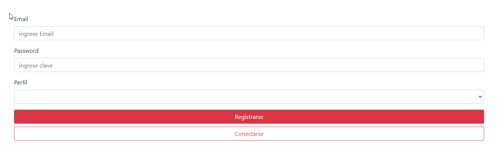
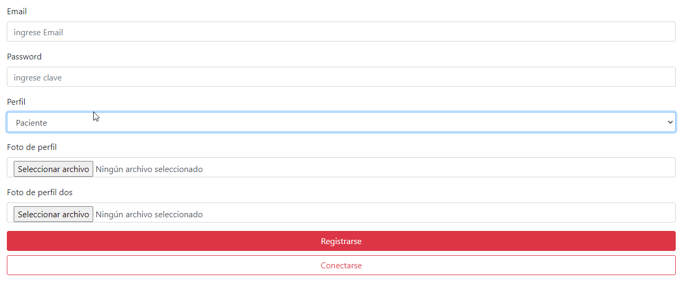
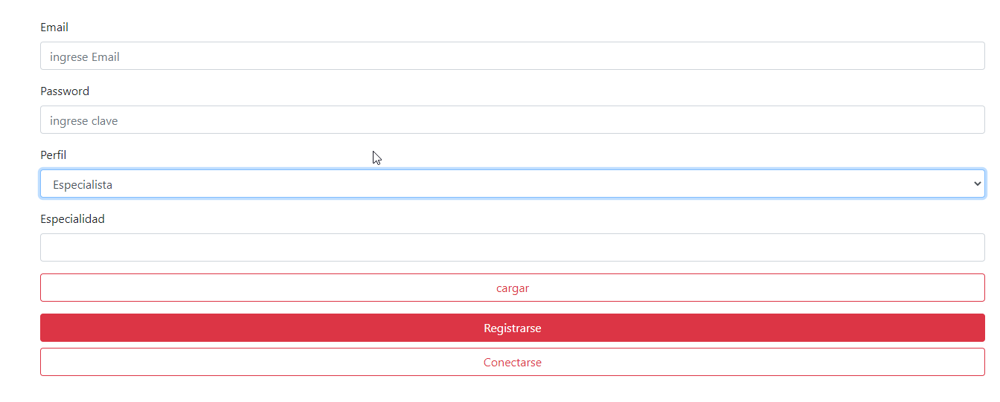
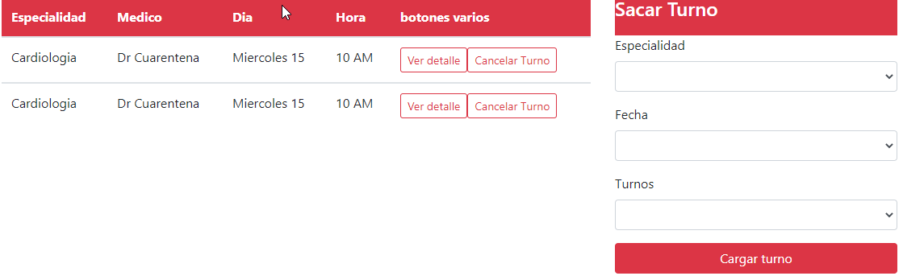
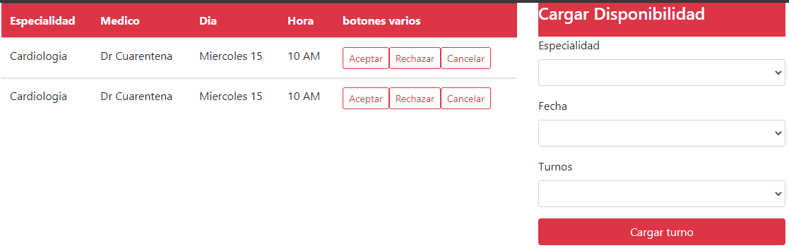

# ClinicaOnline

Es un sistema de gestion de turnos, tratando de que la gestion sea simple y en pocos pasos

# Tecnologia

Se utiliza Angular, bootstrap, typescript y firebase para la base de datos y el storage de archivos

# caso de uso

en el cual el usuario puede seleccionar la especialidad dia y horario que quiere el turno, los medicos pueden cargar su disponibilidad en la cual van a trabajar, aceptar los turnos o rechazarlos y poder cancelarlos, los administradores van a poder crear nuevos administradores y activar medicos

# como se usa

## login
Para loguearse solo pide email y clave

 
## Registro
 
Es un mismo formulario que nos pide algunos datos
 

  
luego podemos selecionar si somos especialista o paciente pidiendote datos de cada uno de estos perfiles
  

   

## Pantallas

Los distintos perfiles ven distintos tipos de datos

paciente

Medico

   
   
